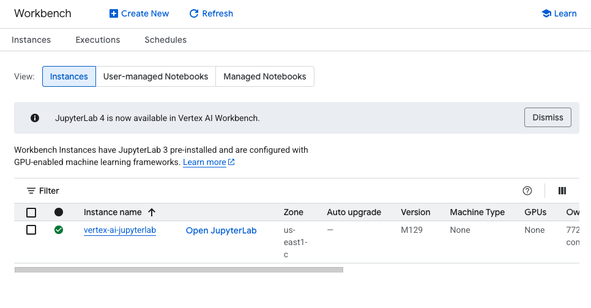
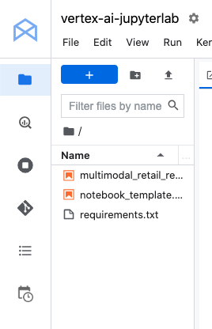
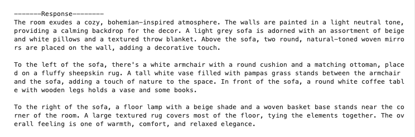
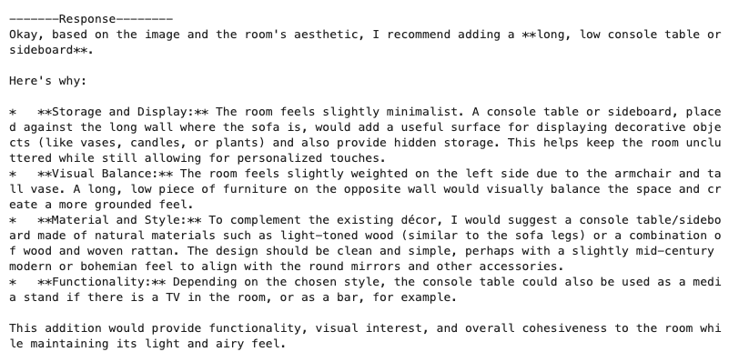
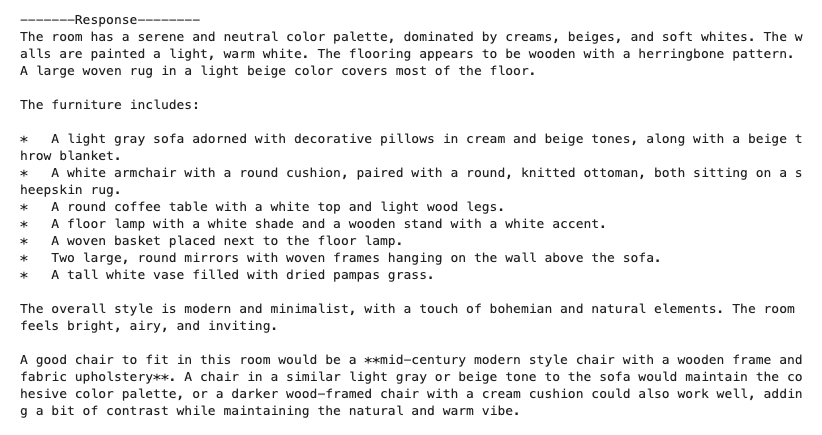
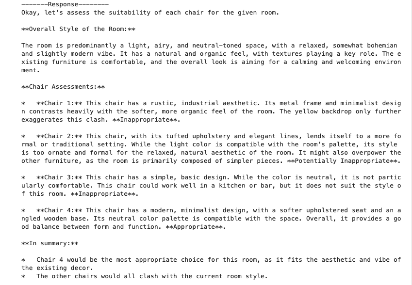
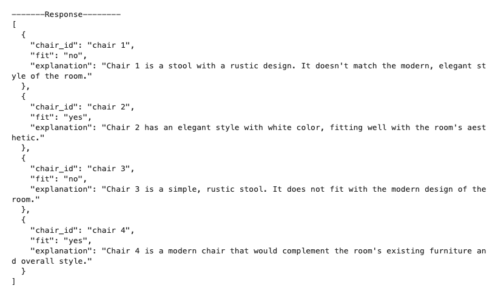

# GCP-Lab-Using-Gemini-for-Multimodal-Retail-Recommendations
GCP Lab Using Gemini for Multimodal Retail Recommendations

### Overview
Gemini is a family of generative AI models developed by Google DeepMind that is designed for multimodal use cases.

For retail companies, recommendation systems improve customer experience and thus can increase sales. In this lab, you will learn how to use the Gemini model to rapidly create a multimodal recommendation system. The Gemini model can provide both recommendations and explanations using a multimodal model.

In this lab, you will begin with a scene (e.g. a living room) and use the Gemini model to perform visual understanding. You will also investigate how the Gemini model can be used to recommend an item (e.g. a chair) from a list of furniture items as input.

#### Gemini
Gemini is a family of powerful generative AI models developed by Google DeepMind, capable of understanding and generating various forms of content, including text, code, images, audio, and video.

#### Gemini API in Vertex AI
The Gemini API in Vertex AI provides a unified interface for interacting with Gemini models. This allows developers to easily integrate these powerful AI capabilities into their applications. For the most up-to-date details and specific features of the latest versions, please refer to the official Gemini documentation.

#### Gemini Models
Gemini Pro: Designed for complex reasoning, including:
Analyzing and summarizing large amounts of information.
Sophisticated cross-modal reasoning (across text, code, images, etc.).
Effective problem-solving with complex codebases.
Gemini Flash: Optimized for speed and efficiency, offering:
Sub-second response times and high throughput.
High quality at a lower cost for a wide range of tasks.
Enhanced multimodal capabilities, including improved spatial understanding, new output modalities (text, audio, images), and native tool use (Google Search, code execution, and third-party functions).

#### Prerequisites
Before starting this lab, you should be familiar with:

Basic Python programming.
General API concepts.
Running Python code in a Jupyter notebook on Vertex AI Workbench.


#### Objectives
In this lab, you will learn how to:

- Use the Gemini model (gemini-2.0-flash) to perform visual understanding
- Take multimodality into consideration in prompting for the Gemini model
- Create a retail recommendation application using the Gemini model


### Task 1. Open the notebook in Vertex AI Workbench

In the Google Cloud console, on the Navigation menu (Navigation menu icon), click Vertex AI > Workbench.

Find the vertex-ai-jupyterlab instance and click on the Open JupyterLab button.

The JupyterLab interface for your Workbench instance opens in a new browser tab.




### Task 2. Set up the notebook
Open the multimodal_retail_recommendations file.

In the Select Kernel dialog, choose Python 3 from the list of available kernels.

Run through the Getting Started and the Import libraries sections of the notebook.

For Project ID, use qwiklabs-gcp-02-8903b5fa0e1c, and for Location, use us-east1.
Note: You can skip any notebook cells that are noted Colab only. If you experience a 429 response from any of the notebook cell executions, wait 1 minute before running the cell again to proceed.




#### Getting Started
Install Gen AI SDK for Python

`%pip install --upgrade google-genai`

#### Restart current runtime
To use the newly installed packages in this Jupyter runtime, you must restart the runtime. You can do this by running the cell below, which will restart the current kernel.

```
# Restart kernel after installs so that your environment can access the new packages
import IPython

app = IPython.Application.instance()
app.kernel.do_shutdown(True)
```

#### Define Google Cloud project information and initialize Vertex AI
Initialize the Vertex AI SDK for Python for your project:

```
# Define project information
PROJECT_ID = "qwiklabs-gcp-02-8903b5fa0e1c"  # @param {type:"string"}
LOCATION = "us-east1"  # @param {type:"string"}

# Create the API client
from google import genai
client = genai.Client(vertexai=True, project=PROJECT_ID, location=LOCATION)
```

#### Import libraries¶
`from google.genai.types import GenerateContentConfig, Part`

#### Using Gemini model
Gemini is a multimodal model that supports adding image and video in text or chat prompts for a text response.

Load Gemini model
`MODEL_ID = "gemini-2.0-flash"`


### Task 3. Use the Gemini model
The Gemini model (gemini-2.0-flash) is a multimodal model that supports adding image and video in text or chat prompts for a text response.

In this task, run through the notebook cells to see how to use the Gemini model to describe a room in details from its image, combining text and image in a single prompt.


#### Visual understanding with Gemini
Here you will ask the Gemini model to describe a room in details from its image. To do that you have to combine text and image in a single prompt.

```
# urls for room images
room_image_url = "https://storage.googleapis.com/github-repo/img/gemini/retail-recommendations/rooms/spacejoy-c0JoR_-2x3E-unsplash.jpg"
room_image = Part.from_uri(file_uri=room_image_url, mime_type="image/jpeg")

prompt = "Describe what's visible in this room and the overall atmosphere:"
contents = [
    room_image,
    prompt,
]

responses = client.models.generate_content_stream(model=MODEL_ID, contents=contents)

print("\n-------Response--------")
for response in responses:
    print(response.text, end="")
```




### Task 4. Generate open recommendations based on built-in knowledge
Using the same image, you can ask the model to recommend a piece of furniture that would fit in it alongside with the description of the room. Note that the model can choose any furniture to recommend in this case, and can do so from its only built-in knowledge.

Using the same image, run through the notebook cells to see how to use the Gemini model to recommend a piece of furniture that would fit in the room, alongside with the description of the room.


```
prompt1 = "Recommend a new piece of furniture for this room:"
prompt2 = "and explain the reason in detail"
contents = [prompt1, room_image, prompt2]

responses = client.models.generate_content_stream(model=MODEL_ID, contents=contents)

print("\n-------Response--------")
for response in responses:
    print(response.text, end="")
```



In the next cell, you will ask the model to recommend a type of chair that would fit in it alongside with the description of the room.

Note that the model can choose any type of chair to recommend in this case.

```
prompt1 = "Describe this room:"
prompt2 = "and recommend a type of chair that would fit in it"
contents = [prompt1, room_image, prompt2]

responses = client.models.generate_content_stream(model=MODEL_ID, contents=contents)

print("\n-------Response--------")
for response in responses:
    print(response.text, end="")
```



#### Generating recommendations based on provided images
Instead of keeping the recommendation open, you can also provide a list of items for the model to choose from. Here you will download a few chair images and set them as options for the Gemini model to recommend from. This is particularly useful for retail companies who want to provide recommendations to users based on the kind of room they have, and the available items that the store offers.

```
# Download and display sample chairs
furniture_image_urls = [
    "https://storage.googleapis.com/github-repo/img/gemini/retail-recommendations/furnitures/cesar-couto-OB2F6CsMva8-unsplash.jpg",
    "https://storage.googleapis.com/github-repo/img/gemini/retail-recommendations/furnitures/daniil-silantev-1P6AnKDw6S8-unsplash.jpg",
    "https://storage.googleapis.com/github-repo/img/gemini/retail-recommendations/furnitures/ruslan-bardash-4kTbAMRAHtQ-unsplash.jpg",
    "https://storage.googleapis.com/github-repo/img/gemini/retail-recommendations/furnitures/scopic-ltd-NLlWwR4d3qU-unsplash.jpg",
]

# Load furniture images as Part Objects
furniture_images = [
    Part.from_uri(file_uri=url, mime_type="image/jpeg") for url in furniture_image_urls
]

# To recommend an item from a selection, you will need to label the item number within the prompt.
# That way you are providing the model with a way to reference each image as you pose a question.
# Labelling images within your prompt also help to reduce hallucinations and overall produce better results.
contents = [
    "Consider the following chairs:",
    "chair 1:",
    furniture_images[0],
    "chair 2:",
    furniture_images[1],
    "chair 3:",
    furniture_images[2],
    "chair 4:",
    furniture_images[3],
    "room:",
    room_image,
    "You are an interior designer. For each chair, explain whether it would be appropriate for the style of the room:",
]

responses = client.models.generate_content_stream(model=MODEL_ID, contents=contents)

print("\n-------Response--------")
for response in responses:
    print(response.text, end="")
```




You can also return the responses in JSON format, to make it easier to plug recommendations into a recommendation system:


```
contents = [
    "Consider the following chairs:",
    "chair 1:",
    furniture_images[0],
    "chair 2:",
    furniture_images[1],
    "chair 3:",
    furniture_images[2],
    "chair 4:",
    furniture_images[3],
    "room:",
    room_image,
    "You are an interior designer. Return in JSON, for each chair, whether it would fit in the room, with an explanation:",
]

responses = client.models.generate_content_stream(
    model=MODEL_ID,
    contents=contents,
    config=GenerateContentConfig(response_mime_type="application/json"),
)

print("\n-------Response--------")
for response in responses:
    print(response.text, end="")
```



### Conclusion
This notebook showed how you can easily build a multimodal recommendation system using Gemini for furniture, but you can also use the similar approach in:

recommending clothes based on an occasion or an image of the venue
recommending wallpaper based on the room and settings
You may also want to explore how you can build a RAG (retrieval-augmented generation) system where you retrieve relevant images from your store inventory to users who can they use Gemini to help identify the most ideal choice from the various options provided, and also explain the rationale to users.


### Congratulations!
Congratulations! In this lab, you have successfully explored how to build a multimodal recommendation system using Gemini for furniture. You have learned how to use the Gemini model to perform visual understanding and how to take multimodality into consideration in prompting for the Gemini model. This lab showed how you can easily build a multimodal recommendation system using Gemini for furniture, but you can also use the similar approach in:

- Recommending clothes based on an occasion or an image of the venue
- Recommending wallpaper based on the room and settings

#### Next steps / learn more
Check out the following resources to learn more about Gemini:
Gemini Overview
Generative AI on Vertex AI Documentation
Generative AI on YouTube
Explore the Vertex AI Cookbook for a curated, searchable gallery of notebooks for Generative AI.
Explore other notebooks and samples in the Google Cloud Generative AI repository.
